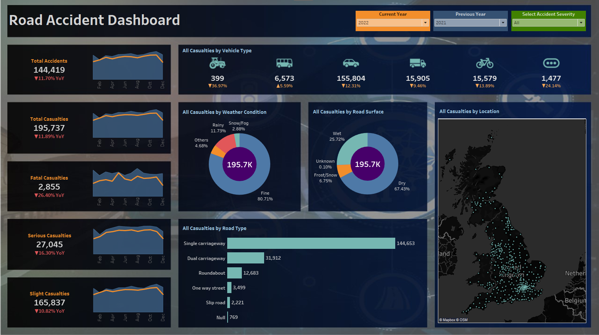
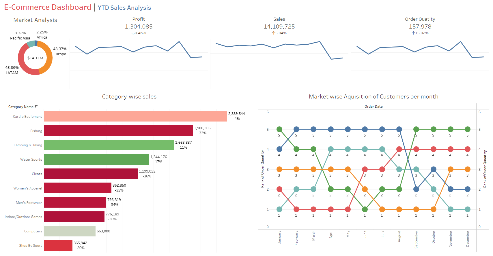
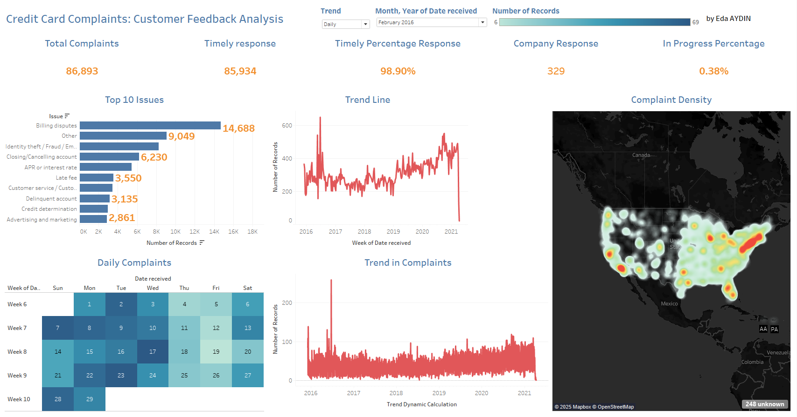
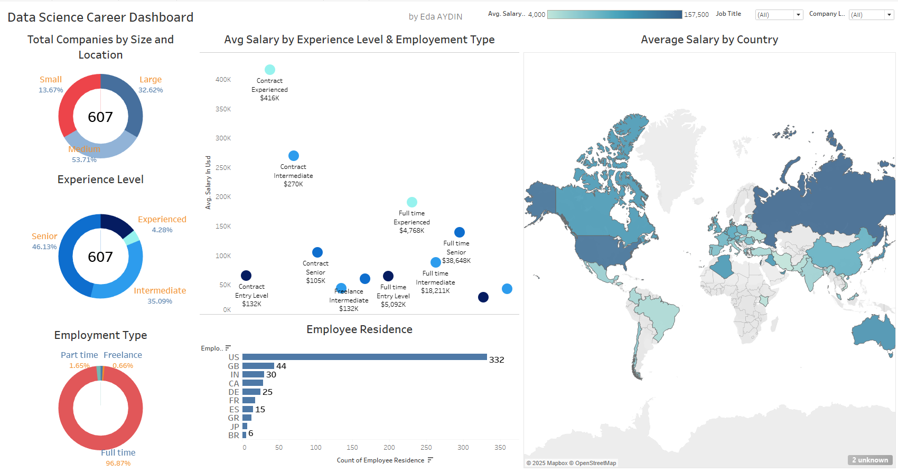
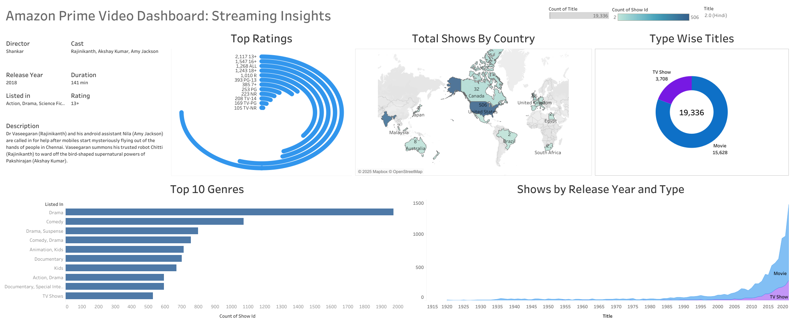
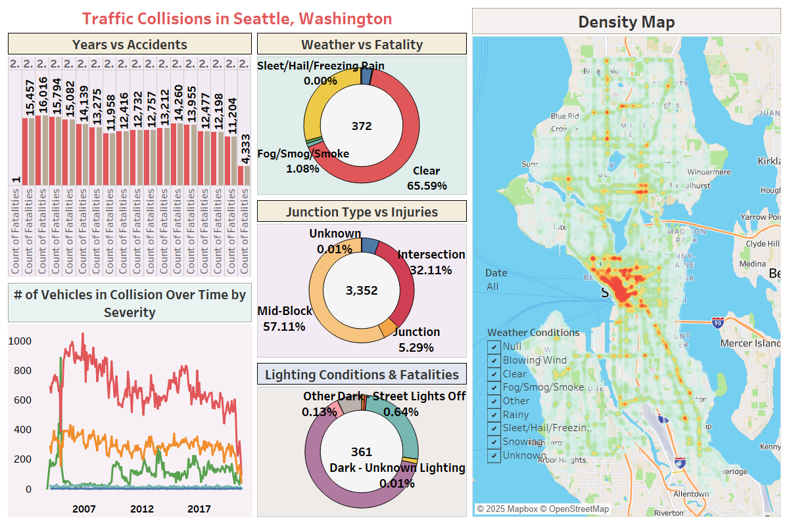
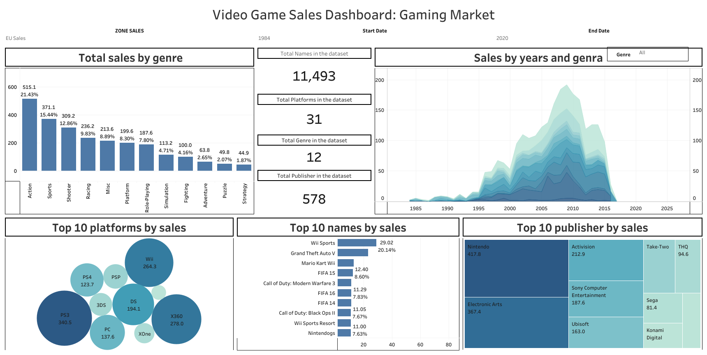

# TableauMastery-20RealWorldProjects

This repository is your ultimate guide to mastering Tableau through 20 real-world projects that tackle diverse, impactful challenges across industries. Whether you're a data enthusiast, Tableau beginner, or seasoned analyst, you'll find actionable insights, creative dashboard designs, and hands-on projects to elevate your Tableau skills.

## Table of Contents

- [TableauMastery-20RealWorldProjects](#tableaumastery-20realworldprojects)
  - [Table of Contents](#table-of-contents)
    - [Project 1: Airbnbs in Seattle: Rental Market Analysis](#project-1-airbnbs-in-seattle-rental-market-analysis)
    - [Project 2: New Year Resolution Tweets: Social Media Analysis](#project-2-new-year-resolution-tweets-social-media-analysis)
    - [Project 3: Road Accident in the UK: Safety Analysis](#project-3-road-accident-in-the-uk-safety-analysis)
    - [Project 4: E-Commerce Dahboard | YTD Sales Analysis](#project-4-e-commerce-dahboard--ytd-sales-analysis)
    - [Project 5: Super Store Sales Dashboard | Retail Analysis](#project-5-super-store-sales-dashboard--retail-analysis)
    - [Project 6: Credit Card Complaints | Customer Service Analysis](#project-6-credit-card-complaints--customer-service-analysis)
    - [Project 7: Data Science Career Dashboard | Job Market Trends](#project-7-data-science-career-dashboard--job-market-trends)
    - [Project 8: Amazon Prime Video Dashboard | Streaming Analysishttps://public.tableau.com/app/profile/edaaydin/viz/AmazonPrimeVideoDashboardStreamingInsights/Dashboard1](#project-8-amazon-prime-video-dashboard--streaming-analysishttpspublictableaucomappprofileedaaydinvizamazonprimevideodashboardstreaminginsightsdashboard1)
    - [Project 9: Traffic Collision in Seattle: Safety and Traffic Analysis](#project-9-traffic-collision-in-seattle-safety-and-traffic-analysis)
    - [Project 10: Video Game Sales Dashboard | Gaming Analysis](#project-10-video-game-sales-dashboard--gaming-analysis)
    - [Project 11: IMDB Movie Review Dataset Dashboard | Film Insights](#project-11-imdb-movie-review-dataset-dashboard--film-insights)
    - [Project 12: Goodreads.com Dataset Dashboard | Book Analysis](#project-12-goodreadscom-dataset-dashboard--book-analysis)

### Project 1: Airbnbs in Seattle: Rental Market Analysis

### Project 2: New Year Resolution Tweets: Social Media Analysis

### Project 3: Road Accident in the UK: Safety Analysis

[Tableau Public Link](https://public.tableau.com/app/profile/edaaydin/viz/RoadAccidentintheUKSafetyAnalysis/RoadAccident_Dashboard)

### Project 4: E-Commerce Dahboard | YTD Sales Analysis

[Tableau Public Link](https://public.tableau.com/app/profile/edaaydin/viz/E-CommerceDashboardYTDSalesAnalysis/E-CommerceDashboardYTDSalesAnalysis)

### Project 5: Super Store Sales Dashboard | Retail Analysis

[Tableau Public Link](https://public.tableau.com/app/profile/edaaydin/viz/SuperStoreSalesDashboardRetailAnalysis_17377480817770/2012SpringSuperStoreSalesDashboard)

### Project 6: Credit Card Complaints | Customer Service Analysis

[Tableau Public Link](https://public.tableau.com/app/profile/edaaydin/viz/CreditCardComplaintsCustomerServiceAnalysis/CreditCardComplaintsCustomerServiceAnalysis)

### Project 7: Data Science Career Dashboard | Job Market Trends

[Tableau Public Link](https://public.tableau.com/app/profile/edaaydin/viz/DataScienceCareerDashboard_17380223719080/DataScienceCareerDashboard)

### Project 8: Amazon Prime Video Dashboard | Streaming Analysishttps://public.tableau.com/app/profile/edaaydin/viz/AmazonPrimeVideoDashboardStreamingInsights/Dashboard1

[Tableau Public Link](https://public.tableau.com/app/profile/edaaydin/viz/AmazonPrimeVideoDashboardStreamingInsights/Dashboard1)

### Project 9: Traffic Collision in Seattle: Safety and Traffic Analysis

[Tableau Public Link](https://public.tableau.com/app/profile/edaaydin/viz/TrafficCollisionsinSeattleWashington/Dashboard1)

### Project 10: Video Game Sales Dashboard | Gaming Analysis

[Tableau Public Link](https://public.tableau.com/app/profile/edaaydin/viz/VideoGameSalesDashboardGamingMarket/Dashboard2)

### Project 11: IMDB Movie Review Dataset Dashboard | Film Insights

[Tableau Public Link](https://public.tableau.com/app/profile/edaaydin/viz/IMDBMovieReviewDatasetDashboard/IMDBMovieReviewDatasetDashboard)

### Project 12: Goodreads.com Dataset Dashboard | Book Analysis

[Tableau Public Link](https://public.tableau.com/app/profile/edaaydin/viz/GoodreadsDatasetDashboard/Goodread_comDataDashboard)
