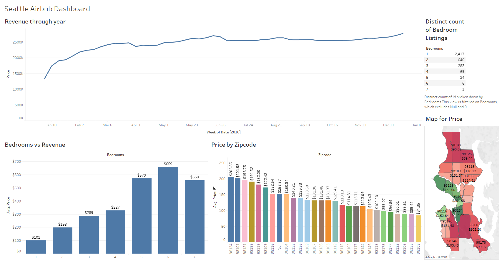
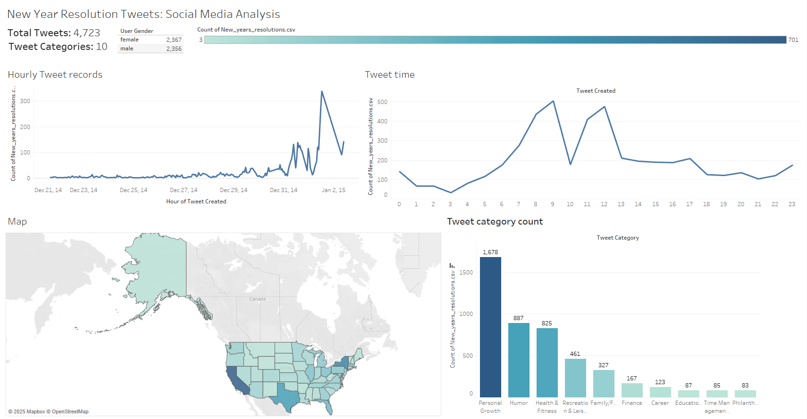

# TableauMastery-20RealWorldProjects

This repository is your ultimate guide to mastering Tableau through 20 real-world projects that tackle diverse, impactful challenges across industries. Whether you're a data enthusiast, Tableau beginner, or seasoned analyst, you'll find actionable insights, creative dashboard designs, and hands-on projects to elevate your Tableau skills.

## Table of Contents

- [TableauMastery-20RealWorldProjects](#tableaumastery-20realworldprojects)
  - [Table of Contents](#table-of-contents)
    - [Project 1: Airbnbs in Seattle: Rental Market Analysis](#project-1-airbnbs-in-seattle-rental-market-analysis)
    - [Project 2: New Year Resolution Tweets: Social Media Analysis](#project-2-new-year-resolution-tweets-social-media-analysis)

### Project 1: Airbnbs in Seattle: Rental Market Analysis

**DataSource**: [Seattle Airbnb Open Data](https://www.kaggle.com/datasets/airbnb/seattle)

**Data Overview**: This dataset part of the Airbnb Inside Initative, details the listing activity of homestays in Seattle, WA.  It includes comprehensive information on listings, such as full descriptions and average review scores, as well as reviews with unique IDs.

**Project Objectives**:

- Market Analysis: Examine the distribution of Airbnb listings across different neighborhoods in Seattle.
- Pricing Strategy: Analyze pricing trends to identify factors influencing rental prices.
- Review Insights: Assess review scores and sentiments to understand guest satisfaction.

**Expected Outcomes**:

- An interactive Tableau dashboard showcasing key metrics and trends in Seattle's Airbnb market.
- Actionable insights for hosts to optimize their listings and for guests to make informed decisions.

### Project 2: New Year Resolution Tweets: Social Media Analysis

